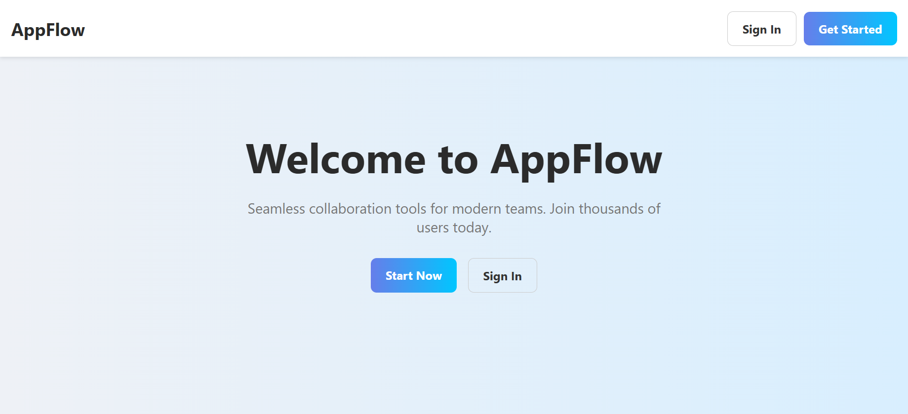
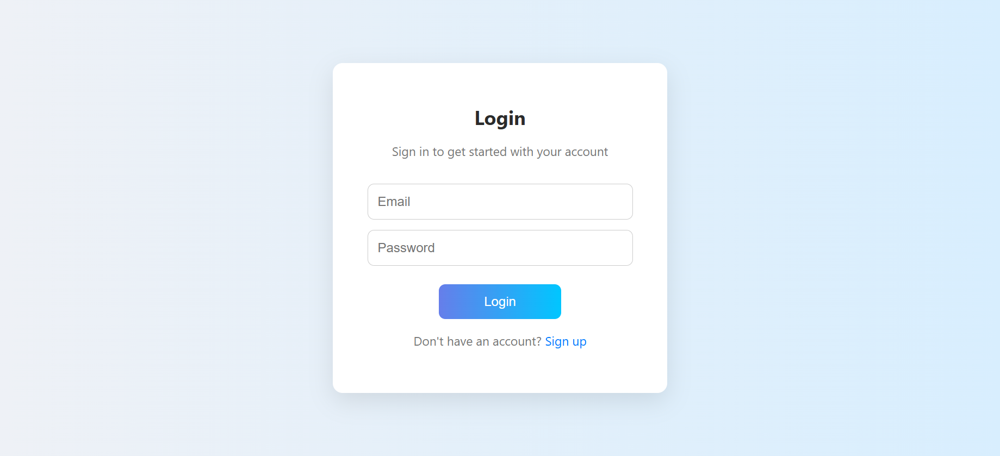
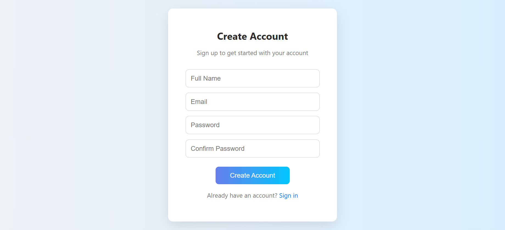
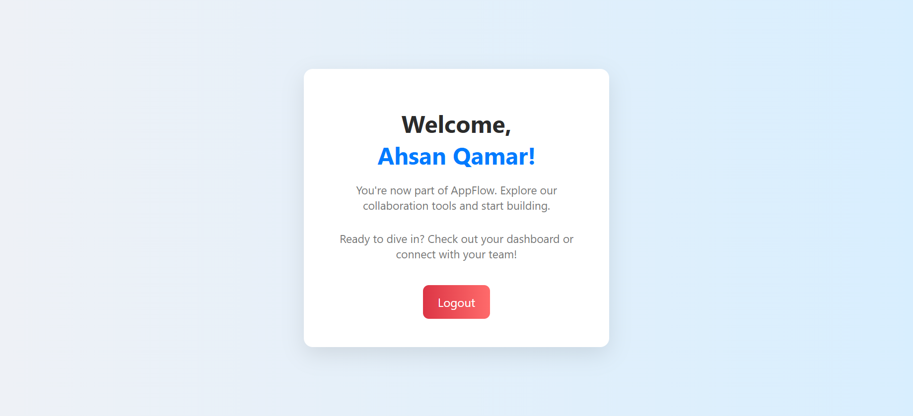

### **README.md**

````markdown
# Secure PHP MySQL Login System

A secure and responsive login system built with PHP, MySQL, HTML, and CSS. Implements **CSRF tokens**, **password hashing**, and **session management** to protect against SQL injection, XSS, and CSRF attacks.

## Features
- User registration & login
- Password hashing with `password_hash()`
- CSRF token generation and validation
- Session-based authentication
- Input sanitization and SQL injection prevention
- Responsive HTML/CSS design

## Screenshot




## Requirements
- PHP 7.4+ (or newer)
- MySQL 5.7+ / MariaDB
- Apache/Nginx server with PHP enabled
- Composer (optional, for dependency management)

## Installation
1. **Clone the repository**
   ```bash
   git clone https://github.com/yourusername/secure-login-system.git
   cd secure-login-system
````

2. **Import the database**

   * Create a database in MySQL.
   * Import `database.sql` into your database.

3. **Configure database connection**

   * Edit `config.php` and set your database credentials:

     ```php
     $db_host = "localhost";
     $db_user = "root";
     $db_pass = "";
     $db_name = "login_system";
     ```

4. **Run the application**

   * Place the project in your web server's root directory.
   * Access via `http://localhost/secure-login-system`.

## CSRF Protection

* Every form includes a hidden CSRF token.
* Token is validated on submission to prevent CSRF attacks.

## File Structure

```
.
├── config.php               # Database connection
├── index.php                # Landing page before login
├── welcome.php              # Landing page after login
├── register.php             # User registration
├── login.php                # User login
├── logout.php               # End session
├── register_process.php     # register_process form submission
├── login_process.php        # Handle login form submission
├── database.sql             # Database schema
└── README.md
```

## Security Practices

* Passwords stored as hashes using `PASSWORD_BCRYPT`
* Prepared statements for all DB queries
* Session regeneration after login
* CSRF token on every form

## License

This project is licensed under the MIT License.

```
